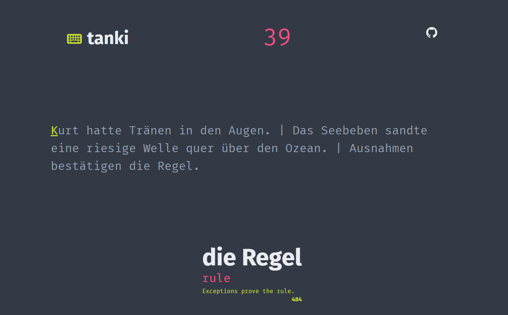

# tanki
##### learn a language while practicing touch typing

## ⇁  WIP
This is not fully baked, additional features can be added, as well as some bug fixes.

## ⇁ self host:
1. change **SERVER_URL** in ***src/env.rs.prod*** to ``http://127.0.0.1:8080`` or server name.
2. ``docker-compose up -d --build``
